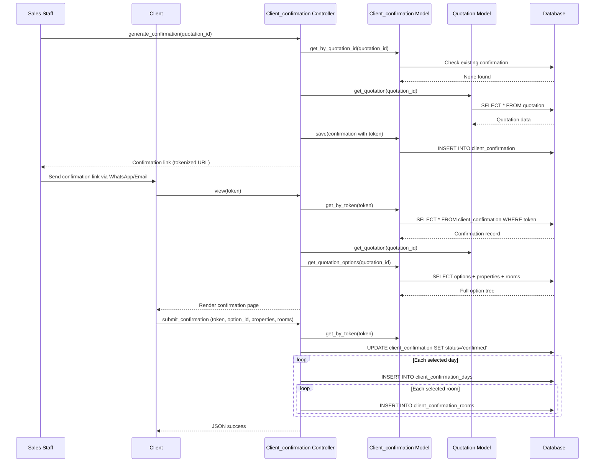

# Workflow: Booking (Lead Conversion to Trip)

## Purpose

Convert a qualified lead into a booked trip through quotation confirmation, property reservation, and payment scheduling. The "booking" is not a single table but a state transition: a lead moves through pipeline stages, a quotation is confirmed by the client, properties are reserved, and payment schedules are created.

## Actors

- **Sales Staff** — Manages lead through pipeline, generates quotation, sends confirmation link
- **Client** — Confirms quotation via public tokenized link (selects option, properties, rooms)
- **Operations Staff** — Manages property reservations after client confirmation
- **Accounts Staff** — Sets up and tracks payment schedules

## Database Tables

| Table | Role |
|-------|------|
| `leads` | Lead master with `lead_current_status` and `leads_quotation_status` |
| `quotation` | Quotation with `quotation_current_status` (2=created, 5=confirmed, 6=cancelled) |
| `quotation_options` | Options within quotation |
| `quotation_confirmation` | Client's confirmed option + day/property/room selections |
| `client_confirmation` | Tokenized confirmation link record |
| `client_confirmation_days` | Day-wise confirmed properties |
| `client_confirmation_rooms` | Confirmed rooms per day |
| `property_reservation` | Hotel reservation records (3-level confirmation) |
| `receipt_scheduler` | Client payment schedule header |
| `receipt_scheduler_installments` | Client payment installments |
| `receipt_scheduler_payments` | Client payment transactions |
| `property_payment_scheduler` | Property payment schedule header |
| `property_payment_scheduler_installments` | Property payment installments |
| `stages` | Lead pipeline stages |
| `priority_status` | Lead priority levels |

## Controllers

- **`Leads.php`** (126 KB) — Lead management, status updates, conversion
- **`Client_confirmation.php`** (8 KB) — Public confirmation flow
  - `view($token)` — Public page for client to view and confirm
  - `submit_confirmation()` — Process client's option/property/room selection
  - `generate_confirmation($quotation_id)` — Admin generates confirmation link
  - `index()` — Admin list of all confirmations
  - `view_confirmation($id)` — Admin detail view
- **`Trips.php`** — Lists active trips (converted leads currently travelling)
- **`LeadsConverted.php`** — Converted leads list

## Models

- `Leads_model.php` — Lead CRUD and status management
- `Client_confirmation_model.php` — Confirmation CRUD, token validation
- `Quotation_model.php` — `get_quotation_options_for_confirmation()`, `get_confirmation_option_details()`
- `Trips_model.php` — Trip queries

## Views

- `Leads/list.php` — Lead list with quotation actions
- `Client_confirmation/client_view.php` — Public confirmation page
- `Client_confirmation/admin_list.php` — Admin confirmation list
- `Client_confirmation/admin_view.php` — Admin confirmation detail
- `Trips/list.php` — Active trips list

## JavaScript / AJAX Endpoints

| Endpoint | Method | Purpose |
|----------|--------|---------|
| `Client_confirmation/generate_confirmation/{quotation_id}` | GET/POST | Generate tokenized confirmation link |
| `Client_confirmation/submit_confirmation` | POST | Client submits option + properties + rooms |
| `Leads/ajax_add` | POST | Create/update lead |
| `Leads/ajax_edit_delete/{id}` | GET | Get lead for editing |
| `Leads/ajax_delete` | POST | Delete lead |

## Validation Rules

- **Client confirmation**: Token must be valid and not expired
- **Selected option**: Required (`selected_option_id`)
- **Selected properties**: Required for each day (`selected_properties`)
- **Selected rooms**: Optional but tracked per property
- **Client details**: `client_name`, `client_email`, `client_phone` captured on confirmation

## Business Rules

1. **Confirmation link generation**: Admin generates a unique token (`md5(uniqid(quotation_id + time))`) and sends the link to the client
2. **One confirmation per quotation**: If a confirmation already exists, generation is blocked
3. **Client selects one option**: The client chooses one quotation option and one property per day
4. **Room selection**: Client can select specific room categories per property
5. **Confirmation status**: `pending` → `confirmed` on client submission
6. **Quotation status update**: On confirmation, quotation status changes to 5 (confirmed)
7. **Lead status update**: Lead `lead_current_status` advances through pipeline stages
8. **Property reservations created**: After confirmation, property_reservation records are created for each confirmed property
9. **Payment schedules**: `receipt_scheduler` (client) and `property_payment_scheduler` (property owner) are set up

## Sequence Diagram



## Data Flow

```
Lead (stage: qualified)
  │
  ▼
Quotation generated (quotation_current_status = 2)
  │
  ▼
Confirmation link generated (client_confirmation, status=pending)
  │
  ▼
Client confirms (selects option + properties + rooms)
  │  ├── client_confirmation_days (per day, confirmed property)
  │  └── client_confirmation_rooms (per property, confirmed rooms)
  │
  ▼
Quotation status → 5 (confirmed)
  │
  ▼
Property Reservations created (one per confirmed property)
  │  └── See: Property Allocation workflow
  │
  ▼
Payment Schedules created
  ├── receipt_scheduler (client payments)
  └── property_payment_scheduler (property owner payments)
  │
  ▼
Lead status → converted (trip active)
```

## Edge Cases

- **Duplicate confirmation**: If admin tries to generate a second confirmation link for the same quotation, it's blocked
- **Invalid/expired token**: `show_404()` if token not found in database
- **Missing properties**: Client must select at least one property per day; empty selection returns error
- **Room mapping**: Room-to-day mapping is resolved post-insert by querying `quotation_properties_rooms` to find the parent property
- **Lead without quotation**: A lead can exist without a quotation; `leads_quotation_status = 0`
