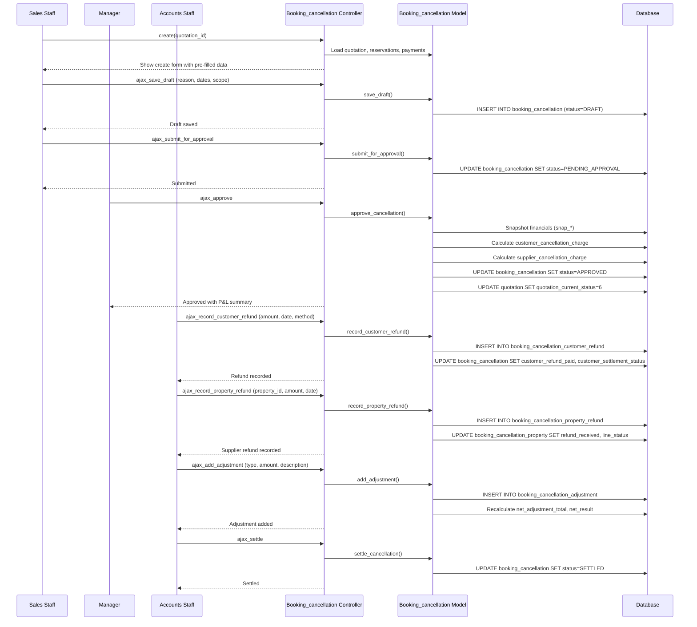

# Workflow: Booking Cancellation

## Purpose

Manage the full lifecycle of a booking cancellation with complete P&L tracking, customer refund management, supplier (property) refund tracking, non-property service cancellations, financial adjustments, and an approval workflow. The system snapshots financial data at cancellation time so historical P&L remains reproducible regardless of subsequent changes.

## Actors

- **Sales Staff** — Initiates cancellation request (DRAFT)
- **Manager** — Reviews and approves/rejects (PENDING_APPROVAL → APPROVED/REJECTED)
- **Accounts Staff** — Settles refunds, records supplier refunds, manages adjustments (APPROVED → SETTLED)
- **Admin** — Can reverse a cancellation (SETTLED → REVERSED)

## Database Tables

| Table | Role |
|-------|------|
| `booking_cancellation` | Cancellation header with P&L fields and approval status |
| `booking_cancellation_reason` | Master list of cancellation reasons |
| `booking_cancellation_customer_refund` | Append-only customer refund transactions (with REVERSAL support) |
| `booking_cancellation_property` | Per-property cancellation details with charge snapshots |
| `booking_cancellation_property_refund` | Per-property supplier refund transactions |
| `booking_cancellation_service` | Non-property supplier cancellations (transport, visa, guide, etc.) |
| `booking_cancellation_adjustment` | Write-offs, goodwill, gateway fees, tax adjustments, incentive clawback |
| `property_reservation` | Linked reservation (FK RESTRICT prevents deletion) |
| `quotation` | Parent quotation (status updated on cancellation) |
| `leads` | Parent lead (denormalized FK for report joins) |

## Controllers

- **`Booking_cancellation.php`** (66 KB) — Main controller
  - `index()` — List view
  - `get()` — DataTables AJAX list
  - `create($quotation_id)` — Create cancellation draft
  - `view($id)` — Detail view with all financial sections
  - `ajax_save_draft()` — Save/update draft cancellation
  - `ajax_submit_for_approval()` — Submit draft for manager approval
  - `ajax_approve()` — Manager approves cancellation
  - `ajax_reject()` — Manager rejects cancellation
  - `ajax_record_customer_refund()` — Record customer refund payment
  - `ajax_reverse_customer_refund()` — Reverse a customer refund
  - `ajax_record_property_refund()` — Record supplier refund
  - `ajax_add_service()` — Add non-property service cancellation
  - `ajax_add_adjustment()` — Add financial adjustment
  - `ajax_settle()` — Mark cancellation as settled
  - `ajax_reverse_cancellation()` — Reverse entire cancellation
  - `ajax_get_reasons()` — Fetch cancellation reasons
  - `ajax_get_summary()` — Fetch P&L summary

## Models

- **`Booking_cancellation_model.php`** (54 KB) — All cancellation DB operations
  - `create_cancellation()`, `save_draft()`, `submit_for_approval()`
  - `approve_cancellation()`, `reject_cancellation()`
  - `record_customer_refund()`, `reverse_customer_refund()`
  - `record_property_refund()`, `add_service()`, `add_adjustment()`
  - `settle_cancellation()`, `reverse_cancellation()`
  - `calculate_pnl()`, `get_cancellation_with_details()`
  - `get_reasons()`, `get_summary()`

## Views

- `Booking_cancellation/list.php` — DataTables list with status badges
- `Booking_cancellation/create.php` — Draft creation form
- `Booking_cancellation/view.php` — Detail with P&L, refunds, services, adjustments
- `Booking_cancellation/script.php` — JavaScript
- `Booking_cancellation/approval_modal.php` — Manager approval modal
- `Booking_cancellation/refund_modal.php` — Refund recording modal
- `Booking_cancellation/adjustment_modal.php` — Adjustment modal
- `Booking_cancellation/service_modal.php` — Service cancellation modal

## JavaScript / AJAX Endpoints

| Endpoint | Method | Purpose |
|----------|--------|---------|
| `Booking_cancellation/create/{quotation_id}` | GET | Show create form |
| `Booking_cancellation/ajax_save_draft` | POST | Save/update draft |
| `Booking_cancellation/ajax_submit_for_approval` | POST | Submit for approval |
| `Booking_cancellation/ajax_approve` | POST | Manager approves |
| `Booking_cancellation/ajax_reject` | POST | Manager rejects |
| `Booking_cancellation/ajax_record_customer_refund` | POST | Record customer refund |
| `Booking_cancellation/ajax_reverse_customer_refund` | POST | Reverse customer refund |
| `Booking_cancellation/ajax_record_property_refund` | POST | Record supplier refund |
| `Booking_cancellation/ajax_add_service` | POST | Add service cancellation |
| `Booking_cancellation/ajax_add_adjustment` | POST | Add adjustment |
| `Booking_cancellation/ajax_settle` | POST | Mark as settled |
| `Booking_cancellation/ajax_reverse_cancellation` | POST | Reverse cancellation |
| `Booking_cancellation/ajax_get_reasons` | GET | Fetch reasons |
| `Booking_cancellation/ajax_get_summary/{id}` | GET | Fetch P&L summary |
| `Booking_cancellation/get` | GET | DataTables list |

## Validation Rules

- **Cancellation reason**: Required (`cancellation_reason_id_fk`)
- **Cancellation request date**: Required
- **Cancellation effective date**: Required (used for policy slab calculation)
- **Customer cancellation charge**: Numeric; can be auto-calculated or manually overridden (`customer_charge_is_override`)
- **Customer refund**: `refund_amount` > 0, `refund_date` required, `refund_method` required
- **Property refund**: `refund_amount` > 0, `refund_date` required
- **Service**: `service_name`, `booked_amount`, `cancellation_charge` required
- **Adjustment**: `adjustment_type`, `amount`, `description` required

## Business Rules

1. **Cancellation scope**: FULL (entire booking) or PARTIAL (specific properties/services)
2. **Reason categories**: GUEST, COMPANY, SUPPLIER, FORCE_MAJEURE, NO_SHOW, OTHER
3. **Policy slab calculation**: `days_before_travel` = effective_date - travel_start_date; determines cancellation charge percentage based on cancellation policy
4. **Financial snapshots**: On approval, the system freezes:
   - `snap_package_value` — Total package value
   - `snap_customer_received` — Total received from client
   - `snap_customer_outstanding` — Outstanding from client
   - `snap_supplier_booked` — Total booked with suppliers
   - `snap_supplier_paid` — Total paid to suppliers
5. **Customer refund flow**: `customer_refund_due` = `snap_customer_received` - `customer_cancellation_charge`; tracked via append-only `booking_cancellation_customer_refund` table
6. **Supplier refund flow**: `supplier_refund_expected` = `snap_supplier_booked` - `supplier_cancellation_charge`; tracked via `booking_cancellation_property_refund`
7. **P&L calculation**: `net_result` = `net_retained_from_customer` + `net_paid_to_suppliers` - `net_other_cost` + `net_adjustment_total`
8. **Approval workflow**: DRAFT → PENDING_APPROVAL → APPROVED → SETTLED (or REJECTED at approval stage)
9. **Reversal**: A settled cancellation can be reversed (SETTLED → REVERSED); restores `previous_quotation_status` and reservation states
10. **Override flag**: `customer_charge_is_override` = 1 when staff manually sets the cancellation charge instead of using policy slab calculation
11. **Refund reversal**: Individual customer refunds can be reversed via `reverses_refund_id_fk` (creates a REVERSAL entry)
12. **Settlement status**: Both customer and supplier settlements tracked independently (NOT_APPLICABLE, PENDING, PARTIAL, COMPLETED, WRITTEN_OFF)
13. **Quotation status**: On approval, quotation status changes to 6 (cancelled); on reversal, restored to `previous_quotation_status`
14. **Property-level cancellation**: Each property in the booking has its own cancellation line with `charge_snapshot`, `refund_expected`, `refund_received`, and `line_status`
15. **Non-property services**: Transport, visa, guide, etc. tracked separately in `booking_cancellation_service`

## Sequence Diagram



## Data Flow

```
Quotation (confirmed, status=5)
  │
  ▼
Cancellation Draft Created (status=DRAFT)
  ├── cancellation_reason (GUEST/COMPANY/SUPPLIER/FORCE_MAJEURE/NO_SHOW/OTHER)
  ├── cancellation_scope (FULL/PARTIAL)
  ├── cancellation_request_date
  ├── cancellation_effective_date
  ├── days_before_travel (calculated)
  └── reason_notes
  │
  ▼
Submitted for Approval (status=PENDING_APPROVAL)
  │
  ▼
Manager Approves (status=APPROVED)
  ├── Financial Snapshots Frozen
  │    ├── snap_package_value
  │    ├── snap_customer_received
  │    ├── snap_customer_outstanding
  │    ├── snap_supplier_booked
  │    └── snap_supplier_paid
  ├── Customer Cancellation Charge (auto or override)
  ├── Supplier Cancellation Charge (per property)
  ├── Quotation status → 6 (cancelled)
  ├── previous_quotation_status saved (for reversal)
  │
  ├── Customer Refunds (append-only, with reversal support)
  │    ├── refund_amount, refund_date, refund_method
  │    ├── customer_refund_due → customer_refund_paid
  │    └── customer_settlement_status: PENDING → PARTIAL → COMPLETED
  │
  ├── Property-Level Cancellations
  │    ├── Per property: charge_snapshot, refund_expected, refund_received
  │    ├── Property Refunds (append-only)
  │    └── line_status: PENDING → SETTLED
  │
  ├── Non-Property Services (transport, visa, guide, etc.)
  │    ├── service_name, booked_amount, cancellation_charge
  │    └── refund_expected, refund_received
  │
  └── Adjustments (write-offs, goodwill, gateway fees, tax, incentive clawback)
       ├── adjustment_type, amount, description
       └── net_adjustment_total
  │
  ▼
Settled (status=SETTLED)
  ├── All customer refunds completed or written off
  ├── All supplier refunds received or written off
  ├── Final P&L: net_result (positive=profit, negative=loss)
  │
  ▼
[Optional] Reversed (status=REVERSED)
  └── Restores quotation status to previous_quotation_status
```

## Edge Cases

- **Partial cancellation**: Only specific properties are cancelled; remaining properties keep their reservations active
- **Customer owes money**: If `customer_cancellation_charge > snap_customer_received`, `customer_refund_due` is negative (customer owes the company)
- **Supplier still payable**: If `supplier_cancellation_charge < snap_supplier_booked - snap_supplier_paid`, `supplier_still_payable` > 0 (company still owes supplier)
- **Refund reversal**: A reversed refund creates a REVERSAL entry with `reverses_refund_id_fk` pointing to the original; net effect adjusts `customer_refund_paid`
- **Force majeure**: Typically results in full refund to customer with no cancellation charge; supplier refunds depend on supplier policy
- **No-show**: Guest doesn't show up; typically full cancellation charge to customer, supplier refunds depend on agreement
- **Reversal after settlement**: Restores quotation to its previous status; all financial records remain for audit
- **Multiple properties, different suppliers**: Each property has its own cancellation line, charge, and refund tracking
