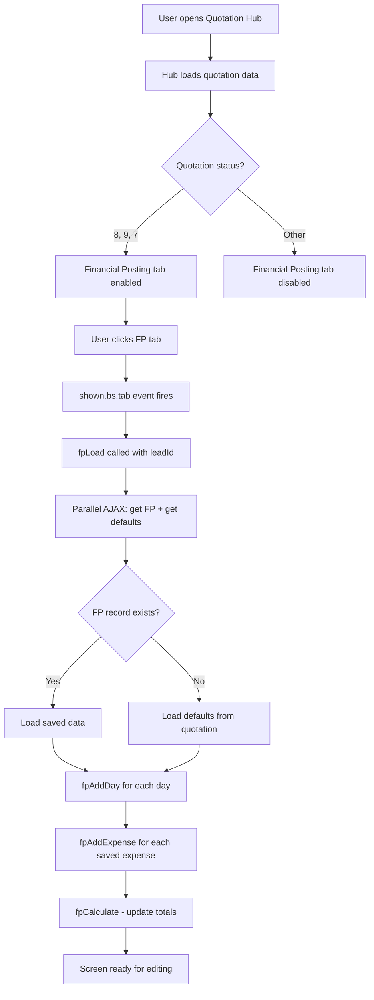
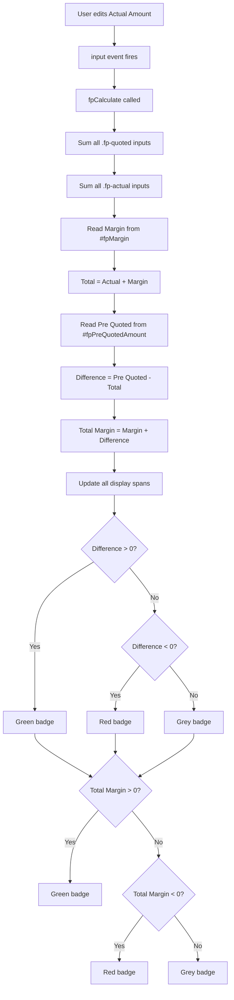
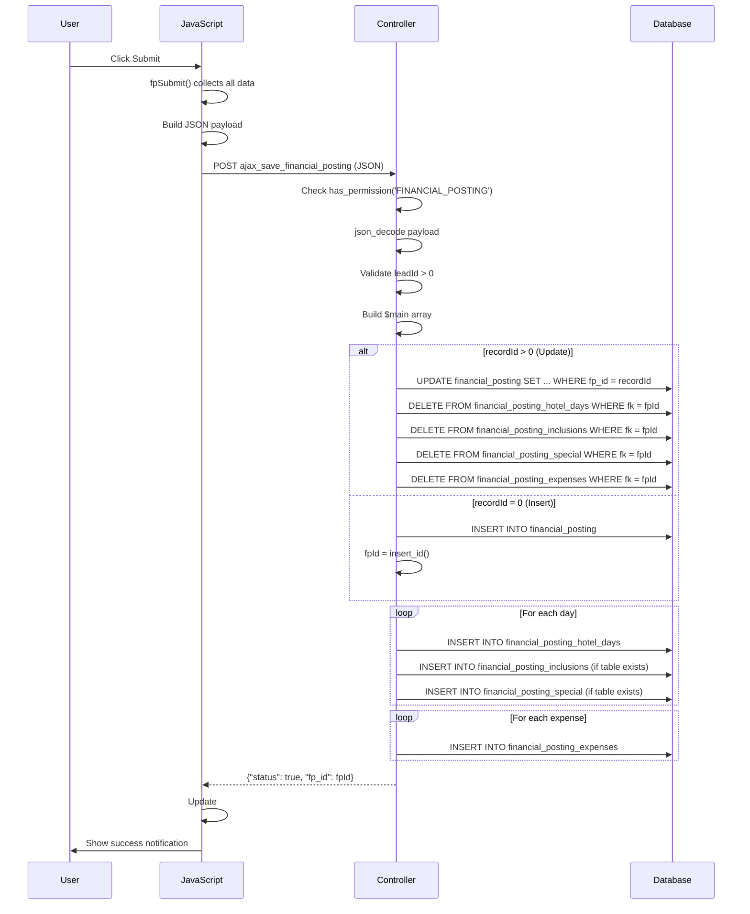
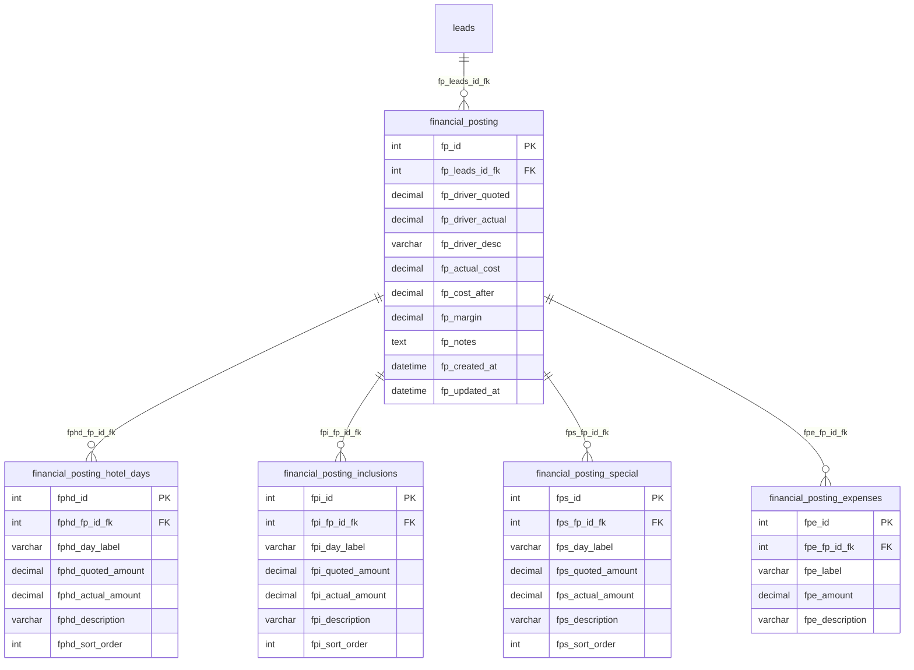
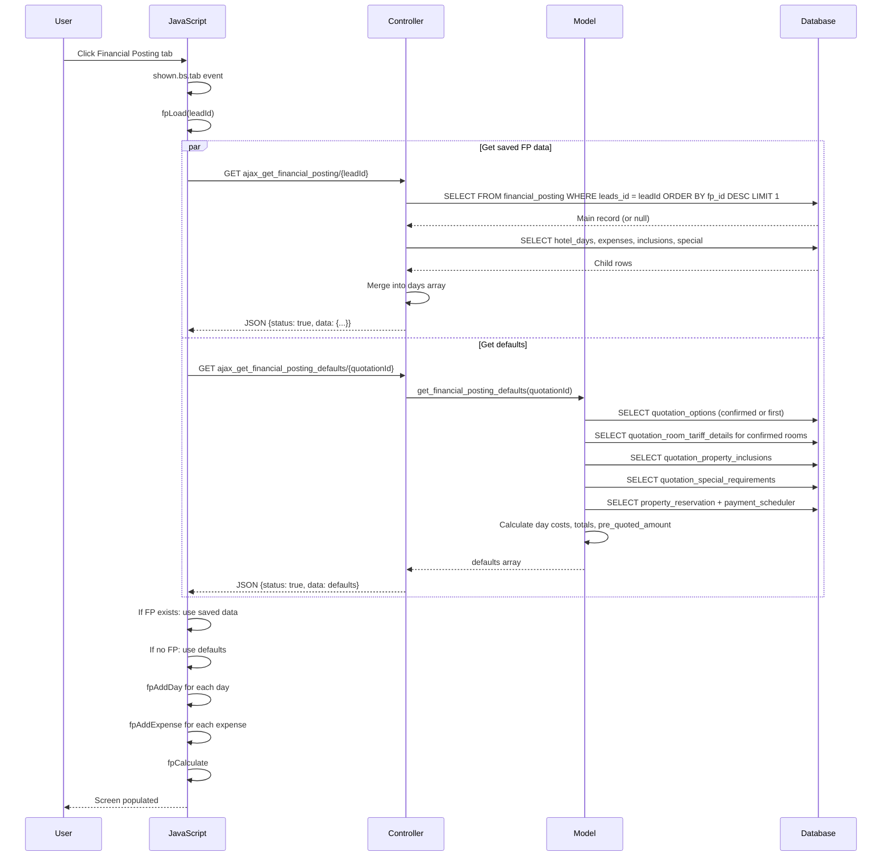

# Workflow: Financial Posting

## 1. PURPOSE

### Why this screen exists

The Financial Posting screen records the **actual operational cost** of a confirmed tour and compares it against the **quoted cost** to analyse profit/loss before and after travel.

### When it becomes available

The Financial Posting tab is part of the **Quotation Hub** screen. It is disabled by default and only enabled at specific quotation lifecycle stages:

| Quotation Status | Code | FP Access |
|-----------------|------|-----------|
| Generated | 1 | Disabled |
| Draft | 2 | Disabled |
| Sent | 3 | Disabled |
| Rejected | 4 | Disabled |
| Confirmed | 5 | Disabled |
| Cancelled | 6 | Disabled |
| **Reservation Completed** | **8** | **Enabled** |
| **Driver Not Assigned** | **9** | **Enabled** |
| **Ready to Trip** | **7** | **Enabled** |

Enabling logic at `@/home/shalice/Documents/TravelGuide/src/Travels-software-latest/application/views/Quotation/hub_script.php:321`:

```javascript
var group2Enabled = (status == 8 || status == 9 || status == 7);
toggleTab('tabFinancialPosting', group2Enabled, group2Tooltip);
```

### Which booking statuses allow editing

Editing is allowed when the tab is enabled — statuses **8**, **9**, and **7**. There is no server-side lock based on quotation status; the save endpoint only checks the `FINANCIAL_POSTING` permission.

### Which users can access it

Users must have the **`FINANCIAL_POSTING`** permission (module: `QUOTATION`, sub-module: `QUOTATION_HUB`). Checked in:

1. **View:** `@/home/shalice/Documents/TravelGuide/src/Travels-software-latest/application/views/Quotation/hub.php:340` — `has_permission('FINANCIAL_POSTING')` wraps the tab.
2. **Controller:** `@/home/shalice/Documents/TravelGuide/src/Travels-software-latest/application/controllers/Quotation.php:8044` — gate on `ajax_save_financial_posting()`.

### Business objective

- Record actual costs incurred per day (hotel, inclusions, special requirements, driver, other expenses).
- Compare actual costs against the pre-quoted amount to determine real profitability.
- Provide a day-wise breakdown so management can identify which days or items are over/under budget.
- Calculate final margin (Total Margin = Margin + Difference) showing true profit or loss.

---

## 2. SCREEN STRUCTURE

The Financial Posting screen is a **tab pane** (`#financialPostingTab`) inside the Quotation Hub. It renders as a single table (`#fpHubTable`).

### Section A: Header Bar

| Element | Description |
|---------|-------------|
| Title | "Financial Posting" with file-invoice-dollar icon |
| Submit button (`onclick="fpSubmit()"`) | Saves all financial posting data |
| Reset button (`onclick="fpReset()"`) | Reloads data from server, discarding unsaved changes |

### Section B: Driver Quote Amount Row (Static)

| Field | Input Name | Editable | Description |
|-------|-----------|----------|-------------|
| Item label | — | No | "Driver Quote Amount" |
| Quoted Amount | `fp_driver_quoted` | **Readonly** | Pre-filled from quotation option's cab amount |
| Actual Amount | `fp_driver_actual` | Yes | Actual driver/transport cost |
| Description | `fp_driver_desc` | Yes | Notes about driver cost |

### Section C: Day-Based Rows (Dynamic)

Generated by `fpAddDay()`. Each day produces **4 rows**: Day Header, Hotel Rent, Property Based Inclusions, Special Requirements. See Section 3.

### Section D: Other Expenses Section

Header with "Add Expense" button. Dynamic rows added by `fpAddExpense()`. See Section 8.

### Section E: Summary / Totals Section

| Row | Display ID | Description |
|-----|-----------|-------------|
| Actual Cost | `#fpActualCost` | Sum of all Quoted Amount values |
| Cost After Financial Post | `#fpCostAfterPost` | Sum of all Actual Amount values |
| Margin | `#fpMargin` | Predefined margin from quotation (display only) |
| Total | `#fpTotalAfterMargin` | Cost After Financial Post + Margin |
| Pre Quoted Amount | `#fpPreQuotedAmount` | Total quoted to client (reference, read-only) |
| Difference | `#fpDifference` | Pre Quoted Amount − Total |
| Total Margin | `#fpTotalMargin` | Margin + Difference (final profit/loss) |
| Description / Notes | `#fpNotes` | Overall description textarea |

### Hidden Fields

| Field | ID | Purpose |
|-------|----|---------|
| Lead ID | `#fp_leads_id` | Links financial posting to a lead |
| Record ID | `#fp_record_id` | Existing `financial_posting.fp_id` (0 if new) |

---

## 3. DAY WISE FINANCIAL POSTING

### How each day is generated

Days are auto-populated from the quotation's itinerary structure via `get_financial_posting_defaults()`. When the tab opens with no existing FP record, `fpLoad()` calls `ajax_get_financial_posting_defaults/{quotation_id}` which returns a `days[]` array. Each day is rendered by `fpAddDay(dayData)`.

### How each day's records are loaded

**No existing FP record:** `fpLoad()` calls both `ajax_get_financial_posting/{leadId}` and `ajax_get_financial_posting_defaults/{quotationId}` in parallel (`$.when(...)`). If no FP record exists, defaults are used: `defaults.days.forEach(day => fpAddDay(day))`.

**Existing FP record:** Saved data is loaded from `financial_posting_hotel_days`, `financial_posting_inclusions`, `financial_posting_special` tables. `d.days.forEach(day => fpAddDay(day))`. Empty driver/margin fields fall back to quotation defaults.

### How totals are calculated

**Day-level:** Each day header shows `Day Total (Quoted)` = `hotel_quoted + inclusions_quoted + special_quoted` (calculated in `fpAddDay()` at hub_script.php:4292).

**Overall:** `fpCalculate()` iterates all `.fp-quoted` and `.fp-actual` inputs and sums them.

### Relationship with itinerary

Days correspond to `quotation_properties_days` records for the confirmed (or first) quotation option. The `day_label` comes from `quotation_properties_days_day`.

### Relationship with reservations

`get_financial_posting_defaults()` queries `property_reservation` joined with `property_payment_scheduler` to get `total_amount`, `discount_amount`, `discounted_total`. If a reservation exists for the confirmed property of a day, the hotel's **actual amount** is set to `discounted_total` (or `total_amount` if no discount), and the description is auto-populated with "Reservation discount: X".

### Relationship with suppliers

Hotel costs come from `quotation_room_tariff_details.manual_total_rate` for confirmed rooms. Driver costs from `quotation_options.quotation_options_cab_amount`. Inclusions from `quotation_property_inclusions`. Special requirements from `quotation_special_requirements`.

---

## 4. EACH ROW TYPE

### 4.1 Driver Quote Amount

| Attribute | Value |
|-----------|-------|
| **Purpose** | Record the transport/driver cost for the tour |
| **Database table** | `financial_posting` (`fp_driver_quoted`, `fp_driver_actual`, `fp_driver_desc`) |
| **Source** | Quoted: `quotation_options.quotation_options_cab_amount` for confirmed/first option |
| **Editable fields** | Actual Amount, Description |
| **Read-only fields** | Quoted Amount (readonly attribute) |
| **Calculation** | Quoted = option's cab amount; Actual = user input |
| **Business rule** | Quoted Amount is pre-filled from quotation and cannot be changed |
| **Dependencies** | Quotation option must exist with cab amount |

### 4.2 Hotel Rent (per day)

| Attribute | Value |
|-----------|-------|
| **Purpose** | Record the actual hotel cost per itinerary day |
| **Database table** | `financial_posting_hotel_days` (`fphd_quoted_amount`, `fphd_actual_amount`, `fphd_description`) |
| **Source** | Quoted: `SUM(quotation_room_tariff_details.manual_total_rate)` for confirmed rooms. Actual: from `property_payment_scheduler.discounted_total` or `total_amount` if reservation exists; otherwise defaults to quoted |
| **Editable fields** | Actual Amount, Description |
| **Read-only fields** | Quoted Amount (readonly) |
| **Calculation** | Quoted = sum of room tariff `manual_total_rate`; Actual = reservation total or user override |
| **Business rule** | If reservation with discount exists, actual is auto-set to discounted total and description shows "Reservation discount: X" |
| **Dependencies** | `quotation_properties_days`, `quotation_properties`, `quotation_properties_rooms`, `quotation_room_tariff_details`, `property_reservation`, `property_payment_scheduler` |

### 4.3 Property Based Inclusions (per day)

| Attribute | Value |
|-----------|-------|
| **Purpose** | Record cost of inclusions provided by the property (breakfast, dinner, activities) |
| **Database table** | `financial_posting_inclusions` (`fpi_quoted_amount`, `fpi_actual_amount`, `fpi_description`) |
| **Source** | Quoted: `SUM(quotation_property_inclusions.inclusion_amount)` for confirmed property. Description: comma-separated inclusion names |
| **Editable fields** | Actual Amount, Description |
| **Read-only fields** | Quoted Amount (readonly) |
| **Calculation** | Quoted = sum of inclusion amounts for confirmed property; Actual = defaults to quoted, user can override |
| **Business rule** | Only inclusions for the confirmed property are included. If no confirmation, all inclusions for the day are summed. |
| **Dependencies** | `quotation_property_inclusions`, `quotation_confirmation` |

### 4.4 Special Requirements (per day)

| Attribute | Value |
|-----------|-------|
| **Purpose** | Record cost of special requirements (cake, decoration, extra arrangements) |
| **Database table** | `financial_posting_special` (`fps_quoted_amount`, `fps_actual_amount`, `fps_description`) |
| **Source** | Quoted: `SUM(quotation_special_requirements.quotation_special_requirements_cost)`. Description: comma-separated requirement names |
| **Editable fields** | Actual Amount, Description |
| **Read-only fields** | Quoted Amount (readonly) |
| **Calculation** | Quoted = sum of special requirement costs for the day; Actual = defaults to quoted, user can override |
| **Business rule** | Special requirements are per-day, not per-property |
| **Dependencies** | `quotation_special_requirements` |

### 4.5 Other Expenses (custom, user-added)

| Attribute | Value |
|-----------|-------|
| **Purpose** | Record additional expenses not covered by standard row types |
| **Database table** | `financial_posting_expenses` (`fpe_label`, `fpe_amount`, `fpe_description`) |
| **Source** | User input only — no auto-population |
| **Editable fields** | Label, Actual Amount, Description |
| **Read-only fields** | Quoted Amount column shows "—" (em dash) |
| **Calculation** | Amount contributes to Actual Total only (`.fp-actual` class) |
| **Business rule** | Can be added, edited, deleted freely. No Quoted Amount. |
| **Dependencies** | None — standalone user entries |

### 4.6 Future Expense Types

The architecture supports adding new row types by:
1. Creating new tables (e.g., `financial_posting_transport`) following the `financial_posting_inclusions` pattern
2. Adding `if ($this->db->table_exists(...))` blocks in `ajax_save_financial_posting()` and `ajax_get_financial_posting()`
3. Extending `fpAddDay()` to render additional rows per day
4. Extending `get_financial_posting_defaults()` to source data from new tables

The `table_exists` checks make the schema backward-compatible.

---

## 5. QUOTED AMOUNT

### Where Quoted Amount comes from

| Row Type | Source Table | Source Column |
|----------|-------------|---------------|
| Driver Quote Amount | `quotation_options` | `quotation_options_cab_amount` |
| Hotel Rent (per day) | `quotation_room_tariff_details` | `manual_total_rate` (summed for confirmed rooms) |
| Property Based Inclusions | `quotation_property_inclusions` | `inclusion_amount` (summed for confirmed property) |
| Special Requirements | `quotation_special_requirements` | `quotation_special_requirements_cost` (summed per day) |
| Other Expenses | N/A | No quoted amount (displays "—") |

### Which module generates it

The **Quotation module** generates all quoted amounts during quotation creation. Room tariffs via `ajax_add_quotation_room_tariff_details`. Inclusions and special requirements copied from package.

### Whether it is editable

**No.** All Quoted Amount inputs have `readonly` HTML attribute.

### When it changes

Only when:
1. The screen is loaded/reloaded (`fpLoad()`)
2. Reset button is clicked (`fpReset()`)
3. Underlying quotation data changes and screen is reopened

### How totals are calculated

**Actual Cost** (sum of Quoted) = sum of all `.fp-quoted` input values, calculated by `fpCalculate()`:

```javascript
$('#fpHubTable .fp-quoted').each(function() {
    quotedTotal += parseFloat($(this).val()) || 0;
});
```

---

## 6. ACTUAL AMOUNT

### Purpose

Records the **real cost incurred** by the company for each line item. Core editable field for post-travel P&L analysis.

### Editable behaviour

- All Actual Amount inputs are editable (`<input type="number" min="0" step="0.01">`)
- Auto-populated on first load from defaults (reservation totals for hotels, quoted amounts for others)
- User can override any value
- Changing an Actual Amount immediately triggers `fpCalculate()` via `input` event listener

### Validation

- HTML `min="0"` prevents negative values in UI
- `step="0.01"` enforces 2 decimal places
- Server-side: values cast to `(float)` — no explicit negative/zero validation
- Empty values default to `0` via `parseFloat($(this).val()) || 0`

### Database storage

| Row Type | Table | Column | Type |
|----------|-------|--------|------|
| Driver | `financial_posting` | `fp_driver_actual` | DECIMAL(10,2) |
| Hotel | `financial_posting_hotel_days` | `fphd_actual_amount` | DECIMAL(10,2) |
| Inclusions | `financial_posting_inclusions` | `fpi_actual_amount` | DECIMAL(12,2) |
| Special | `financial_posting_special` | `fps_actual_amount` | DECIMAL(12,2) |
| Other Expenses | `financial_posting_expenses` | `fpe_amount` | DECIMAL(10,2) |

### How Actual Cost affects profitability

Actual Amounts are summed into **Cost After Financial Post**. This feeds into:
- **Total** = Cost After Financial Post + Margin
- **Difference** = Pre Quoted Amount − Total
- **Total Margin** = Margin + Difference

If actual costs exceed quoted costs, Difference becomes negative, reducing Total Margin.

### How recalculation works

`fpCalculate()` runs on every `input` event on `.fp-quoted` or `.fp-actual` fields. Re-sums all values and updates all summary fields in real-time. No server call needed.

---

## 7. DESCRIPTION COLUMN

### Purpose

Free-text notes about each cost line item. Serves as audit trail and context for actual cost deviations.

### Maximum length

| Row Type | DB Column | Max Length |
|----------|-----------|------------|
| Driver | `fp_driver_desc` | VARCHAR(255) |
| Hotel | `fphd_description` | VARCHAR(255) |
| Inclusions | `fpi_description` | VARCHAR(500) |
| Special | `fps_description` | VARCHAR(500) |
| Other Expenses | `fpe_description` | VARCHAR(255) |
| Overall Notes | `fp_notes` | TEXT |

### Usage

- Auto-populated for hotel rows: "Reservation discount: 500.00"
- Auto-populated for inclusions: comma-separated inclusion names
- Auto-populated for special requirements: comma-separated requirement names
- User can override or add notes

### Audit requirement

No mandatory validation requiring descriptions, but recommended for audit.

### Business rules

- No server-side validation on content
- HTML escaped via `escapeHtml()` before rendering
- Empty descriptions stored as empty strings

---

## 8. OTHER EXPENSES

### How additional expenses work

User-created custom cost line items with a **label** (name), **amount** (actual only), and **description**.

### Who can add them

Any user with `FINANCIAL_POSTING` permission.

### Multiple expense support

Unlimited. "Add Expense" button (`fpAddExpense()`) can be clicked multiple times. Each row added after the last expense or after `#fpOtherExpHeader`.

### Editing

All fields editable:
- **Label**: `<input type="text" name="exp_labels[]">`
- **Amount**: `<input type="number" name="exp_amounts[]" min="0" step="0.01">` (class `fp-actual`)
- **Description**: `<input type="text" name="exp_descs[]">`

### Deleting

Trash icon button (`onclick="fpRemoveRow(this)"`) removes the `<tr>` and triggers `fpCalculate()`.

### Categories

No predefined categories. Label is free-text (e.g., "Visa Fees", "Guide Tips", "Toll Charges", "GST").

### Calculation

Expense amounts included in **Cost After Financial Post** (via `fp-actual` class). Not included in **Actual Cost** (no quoted amount).

### Storage

Stored in `financial_posting_expenses`. On save, all existing rows are **deleted and re-inserted** (no update-in-place).

---

## 9. DAY TOTALS

### How Day Total is calculated

Each day header displays `Day Total (Quoted)`:

```javascript
var daySubtotal = (parseFloat(hotelQuoted) || 0) + (parseFloat(incQuoted) || 0) + (parseFloat(specialQuoted) || 0);
```

### Formula

```
Day Total (Quoted) = Hotel Quoted + Inclusions Quoted + Special Requirements Quoted
```

### When it refreshes

The day subtotal is **static** after initial render — not dynamically updated. Overall totals update dynamically via `fpCalculate()`.

### How it contributes to overall totals

Each day's quoted values contribute to **Actual Cost** (sum of Quoted). Each day's actual values contribute to **Cost After Financial Post** (sum of Actual).

---

## 10. SUMMARY SECTION

### 10.1 Actual Cost

| Attribute | Value |
|-----------|-------|
| **Purpose** | Sum of all Quoted Amounts |
| **Formula** | `SUM(all .fp-quoted inputs)` |
| **Source** | `fpCalculate()` iterates `$('#fpHubTable .fp-quoted')` |
| **Display ID** | `#fpActualCost` |
| **Example** | driver=5000 + day1 hotel=3000 + day1 inc=500 + day1 special=200 + day2 hotel=4000 = 12,700.00 |

### 10.2 Cost After Financial Post

| Attribute | Value |
|-----------|-------|
| **Purpose** | Sum of all Actual Amounts (including other expenses) |
| **Formula** | `SUM(all .fp-actual inputs)` |
| **Source** | `fpCalculate()` iterates `$('#fpHubTable .fp-actual')` |
| **Display ID** | `#fpCostAfterPost` |
| **Example** | driver=4500 + day1 hotel=2800 + day1 inc=500 + day1 special=150 + day2 hotel=3800 + expense=300 = 12,050.00 |

### 10.3 Margin

| Attribute | Value |
|-----------|-------|
| **Purpose** | Predefined margin from quotation option |
| **Formula** | `quotation_options.quotation_options_margin_value` |
| **Source** | `get_financial_posting_defaults()` → `defaults.margin_value` |
| **Display ID** | `#fpMargin` (text display) |
| **Example** | 5,000.00 |

### 10.4 Total

| Attribute | Value |
|-----------|-------|
| **Purpose** | Total cost after financial posting plus margin |
| **Formula** | `Cost After Financial Post + Margin` |
| **Source** | `fpCalculate()` → `totalAfterMargin = actualTotal + margin` |
| **Display ID** | `#fpTotalAfterMargin` |
| **Example** | 12,050 + 5,000 = 17,050.00 |

### 10.5 Pre Quoted Amount

| Attribute | Value |
|-----------|-------|
| **Purpose** | Total amount quoted to the client (reference benchmark) |
| **Formula** | `hotelTotal + inclusionsTotal + specialTotal + driverAmount + marginValue` |
| **Source** | `get_financial_posting_defaults()` at `Quotation_model.php:1289` |
| **Display ID** | `#fpPreQuotedAmount` |
| **Example** | 7,000 + 500 + 200 + 5,000 + 5,000 = 17,700.00 |
| **Note** | Independently calculated, NOT same as `quotation_options_total_quote_rate` |

### 10.6 Difference

| Attribute | Value |
|-----------|-------|
| **Purpose** | Difference between pre-quoted and actual total |
| **Formula** | `Pre Quoted Amount − Total` |
| **Source** | `fpCalculate()` → `difference = preQuoted - totalAfterMargin` |
| **Display ID** | `#fpDifference` |
| **Example** | 17,700 − 17,050 = 650.00 (positive = profit) |
| **Visual** | Green badge > 0, red badge < 0, grey badge = 0 |

### 10.7 Total Margin

| Attribute | Value |
|-----------|-------|
| **Purpose** | Final profit/loss figure |
| **Formula** | `Margin + Difference` |
| **Source** | `fpCalculate()` → `totalMargin = margin + difference` |
| **Display ID** | `#fpTotalMargin` |
| **Example** | 5,000 + 650 = 5,650.00 (profit) |
| **Visual** | Green badge > 0, red badge < 0, grey badge = 0 |

### 10.8 Description / Notes

| Attribute | Value |
|-----------|-------|
| **Purpose** | Overall notes about the financial posting |
| **Source** | User input in `<textarea id="fp_notes">` |
| **Display ID** | `#fpNotes` |
| **Storage** | `financial_posting.fp_notes` (TEXT) |

---

## 11. COMPLETE CALCULATION LOGIC

### Formulas (as implemented)

```
Actual Cost              = SUM(all Quoted Amounts)
                           = fp_driver_quoted
                           + SUM(fphd_quoted_amount)
                           + SUM(fpi_quoted_amount)
                           + SUM(fps_quoted_amount)

Cost After Financial Post = SUM(all Actual Amounts)
                           = fp_driver_actual
                           + SUM(fphd_actual_amount)
                           + SUM(fpi_actual_amount)
                           + SUM(fps_actual_amount)
                           + SUM(fpe_amount)

Margin                   = quotation_options_margin_value

Total                    = Cost After Financial Post + Margin

Pre Quoted Amount        = hotelTotal + inclusionsTotal + specialTotal
                           + driverAmount + marginValue

Difference               = Pre Quoted Amount − Total

Total Margin             = Margin + Difference
```

### JavaScript Implementation

From `@/home/shalice/Documents/TravelGuide/src/Travels-software-latest/application/views/Quotation/hub_script.php:4362-4408`:

```javascript
function fpCalculate() {
    var quotedTotal = 0, actualTotal = 0;
    $('#fpHubTable .fp-quoted').each(function() {
        quotedTotal += parseFloat($(this).val()) || 0;
    });
    $('#fpHubTable .fp-actual').each(function() {
        actualTotal += parseFloat($(this).val()) || 0;
    });
    var margin = parseFloat($('#fpMargin').text()) || 0;
    var totalAfterMargin = actualTotal + margin;
    var preQuoted = parseFloat($('#fpPreQuotedAmount').text()) || 0;
    var difference = preQuoted - totalAfterMargin;

    $('#fpActualCost').text(quotedTotal.toFixed(2));
    $('#fpCostAfterPost').text(actualTotal.toFixed(2));
    $('#fpTotalAfterMargin').text(totalAfterMargin.toFixed(2));
    $('#fpDifference').text(difference.toFixed(2));
    // Badge: green if >0, red if <0, grey if =0
    var totalMargin = margin + difference;
    $('#fpTotalMargin').text(totalMargin.toFixed(2));
    // Badge: green if >0, red if <0, grey if =0
}
```

### PHP Implementation (Pre Quoted Amount)

From `@/home/shalice/Documents/TravelGuide/src/Travels-software-latest/application/models/Quotation_model.php:1287-1289`:

```php
$defaults['pre_quoted_amount'] = $hotelTotal + $inclusionsTotal
    + $specialTotal + $driverAmount + $marginValue;
```

### Worked Example

| Item | Quoted | Actual |
|------|--------|--------|
| Driver | 5,000 | 4,500 |
| Day 1 Hotel | 3,000 | 2,800 |
| Day 1 Inclusions | 500 | 500 |
| Day 1 Special | 200 | 150 |
| Day 2 Hotel | 4,000 | 3,800 |
| Other Expense (Guide Tips) | — | 300 |

```
Actual Cost              = 12,700.00
Cost After Financial Post = 12,050.00
Margin                   = 5,000.00
Total                    = 17,050.00
Pre Quoted Amount        = 17,700.00
Difference               = +650.00 (green — profit)
Total Margin             = 5,650.00 (green — profit)
```

---

## 12. USER INTERACTION

### Changing Quoted Amount

- **Not possible.** All Quoted Amount inputs have `readonly` attribute.
- Quoted amounts are auto-populated from quotation data on load.

### Changing Actual Amount

- User types a new value in any Actual Amount input.
- The `input` event listener triggers `fpCalculate()` immediately.
- All summary fields update in real-time.
- No server call is made until Submit.

### Adding Expense

- User clicks "Add Expense" button.
- `fpAddExpense()` adds a new `<tr class="fp-expense">` after the last expense row.
- New row has empty label, amount, and description fields.
- `fpCalculate()` runs to update totals.

### Deleting Expense

- User clicks trash icon on an expense row.
- `fpRemoveRow(this)` removes the `<tr>` from DOM.
- `fpCalculate()` runs to update totals.

### Saving

- User clicks "Submit" → `fpSubmit()` collects all data into JSON payload.
- AJAX POST to `Quotation/ajax_save_financial_posting`.
- On success: notification "Financial posting saved successfully", `#fp_record_id` updated with returned `fp_id`.
- On error: error notification displayed.

### Refreshing / Resetting

- User clicks "Reset" → `fpReset()` calls `fpLoad(leadId)`, reloading from server, discarding unsaved changes.

### Reopening

- User navigates away from Financial Posting tab and returns.
- `shown.bs.tab` event triggers `fpLoad(leadId)` again.
- If saved record exists, loads saved data. If not, auto-populates from defaults.

### Changing Itinerary

- If quotation itinerary is modified after an FP record exists, the saved FP record still shows old days. Must reset or re-save to pick up new itinerary days.
- No automatic sync between itinerary changes and existing FP records.

### Adding New Day

- The Hub version does not have an "Add Day" button for Financial Posting.
- Days are auto-generated from the quotation itinerary only.

### Removing Day

- No UI to remove a day from the Financial Posting table.
- Days are driven entirely by the quotation itinerary structure.

---

## 13. DATABASE MAPPING

### financial_posting (main table)

| Screen Field | DB Column | Type | JS Variable | AJAX Endpoint |
|-------------|-----------|------|-------------|---------------|
| Record ID | `fp_id` | INT PK | `#fp_record_id` | Save: POST `Quotation/ajax_save_financial_posting` |
| Lead ID | `fp_leads_id_fk` | INT FK→leads | `#fp_leads_id` | Get: GET `Quotation/ajax_get_financial_posting/{leadId}` |
| Driver Quoted | `fp_driver_quoted` | DECIMAL(10,2) | `[name="fp_driver_quoted"]` | Same |
| Driver Actual | `fp_driver_actual` | DECIMAL(10,2) | `[name="fp_driver_actual"]` | Same |
| Driver Description | `fp_driver_desc` | VARCHAR(255) | `[name="fp_driver_desc"]` | Same |
| Actual Cost (total) | `fp_actual_cost` | DECIMAL(10,2) | `#fpActualCost` | Same |
| Cost After (total) | `fp_cost_after` | DECIMAL(10,2) | `#fpCostAfterPost` | Same |
| Margin | `fp_margin` | DECIMAL(10,2) | `#fpMargin` | Same |
| Notes | `fp_notes` | TEXT | `#fpNotes` | Same |
| Created At | `fp_created_at` | DATETIME | N/A | Auto |
| Updated At | `fp_updated_at` | DATETIME | N/A | Auto |

### financial_posting_hotel_days

| Screen Field | DB Column | Type | JS Payload Key |
|-------------|-----------|------|----------------|
| — | `fphd_id` | INT PK | N/A |
| — | `fphd_fp_id_fk` | INT FK→financial_posting | N/A |
| Day Label | `fphd_day_label` | VARCHAR(100) | `day_label` |
| Hotel Quoted | `fphd_quoted_amount` | DECIMAL(10,2) | `hotel_quoted` |
| Hotel Actual | `fphd_actual_amount` | DECIMAL(10,2) | `hotel_actual` |
| Hotel Description | `fphd_description` | VARCHAR(255) | `hotel_desc` |
| Sort Order | `fphd_sort_order` | INT | Array index |

### financial_posting_inclusions

| Screen Field | DB Column | Type | JS Payload Key |
|-------------|-----------|------|----------------|
| — | `fpi_id` | INT PK | N/A |
| — | `fpi_fp_id_fk` | INT FK | N/A |
| Day Label | `fpi_day_label` | VARCHAR(100) | `day_label` |
| Inclusions Quoted | `fpi_quoted_amount` | DECIMAL(12,2) | `inc_quoted` |
| Inclusions Actual | `fpi_actual_amount` | DECIMAL(12,2) | `inc_actual` |
| Inclusions Description | `fpi_description` | VARCHAR(500) | `inc_desc` |
| Sort Order | `fpi_sort_order` | INT | Array index |

### financial_posting_special

| Screen Field | DB Column | Type | JS Payload Key |
|-------------|-----------|------|----------------|
| — | `fps_id` | INT PK | N/A |
| — | `fps_fp_id_fk` | INT FK | N/A |
| Day Label | `fps_day_label` | VARCHAR(100) | `day_label` |
| Special Quoted | `fps_quoted_amount` | DECIMAL(12,2) | `special_quoted` |
| Special Actual | `fps_actual_amount` | DECIMAL(12,2) | `special_actual` |
| Special Description | `fps_description` | VARCHAR(500) | `special_desc` |
| Sort Order | `fps_sort_order` | INT | Array index |

### financial_posting_expenses

| Screen Field | DB Column | Type | JS Payload Key |
|-------------|-----------|------|----------------|
| — | `fpe_id` | INT PK | N/A |
| — | `fpe_fp_id_fk` | INT FK | N/A |
| Expense Label | `fpe_label` | VARCHAR(255) | `exp_labels[]` |
| Expense Amount | `fpe_amount` | DECIMAL(10,2) | `exp_amounts[]` |
| Expense Description | `fpe_description` | VARCHAR(255) | `exp_descs[]` |

### Defaults Source Tables (read-only)

| Source Table | Source Column | Used For |
|-------------|---------------|----------|
| `quotation_options` | `quotation_options_cab_amount` | Driver Quoted |
| `quotation_options` | `quotation_options_margin_value` | Margin |
| `quotation_room_tariff_details` | `manual_total_rate` | Hotel Quoted per day |
| `quotation_property_inclusions` | `inclusion_amount`, `inclusion_name` | Inclusions Quoted + Description |
| `quotation_special_requirements` | `quotation_special_requirements_cost`, `..._name` | Special Quoted + Description |
| `quotation_confirmation` | `option_id_fk`, `properties_id_fk`, `properties_room_id_fk` | Identifying confirmed option/property/rooms |
| `property_reservation` | `properties_id_fk` | Linking to reservation |
| `property_payment_scheduler` | `total_amount`, `discount_amount`, `discounted_total` | Hotel Actual from reservation |
| `quotation_properties_days` | `quotation_properties_days_id`, `..._day` | Day structure |
| `quotation_properties` | `quotation_properties_id`, `properties_id_fk` | Property mapping |
| `quotation_properties_rooms` | `quotation_properties_rooms_id` | Room mapping |

### Foreign Key Constraints

```
financial_posting.fp_leads_id_fk       → leads.leads_id          (CASCADE)
financial_posting_hotel_days.fphd_fp_id_fk   → financial_posting.fp_id  (CASCADE)
financial_posting_inclusions.fpi_fp_id_fk    → financial_posting.fp_id  (CASCADE)
financial_posting_special.fps_fp_id_fk       → financial_posting.fp_id  (CASCADE)
financial_posting_expenses.fpe_fp_id_fk      → financial_posting.fp_id  (CASCADE)
```

All FKs use `ON DELETE CASCADE ON UPDATE CASCADE`, so deleting a lead or FP record automatically removes all child rows.

---

## 14. SAVE WORKFLOW

### What happens after Save

1. User clicks "Submit" → `fpSubmit()` called
2. JavaScript collects all data from `#fpHubTable` into JSON payload
3. AJAX POST to `Quotation/ajax_save_financial_posting` with `Content-Type: application/json`
4. Controller validates `FINANCIAL_POSTING` permission
5. Controller decodes JSON payload
6. Validates `fp_leads_id_fk` is present and non-zero

### Tables updated / inserted

**If `fp_record_id > 0` (UPDATE existing):**

| Table | Operation |
|-------|-----------|
| `financial_posting` | UPDATE (where `fp_id = recordId`) |
| `financial_posting_hotel_days` | DELETE all (where `fphd_fp_id_fk = fpId`), then INSERT new |
| `financial_posting_inclusions` | DELETE all (where `fpi_fp_id_fk = fpId`), then INSERT new (if table exists) |
| `financial_posting_special` | DELETE all (where `fps_fp_id_fk = fpId`), then INSERT new (if table exists) |
| `financial_posting_expenses` | DELETE all (where `fpe_fp_id_fk = fpId`), then INSERT new |

**If `fp_record_id = 0` (INSERT new):**

| Table | Operation |
|-------|-----------|
| `financial_posting` | INSERT, get `insert_id()` as `$fpId` |
| `financial_posting_hotel_days` | INSERT new rows |
| `financial_posting_inclusions` | INSERT new rows (if table exists) |
| `financial_posting_special` | INSERT new rows (if table exists) |
| `financial_posting_expenses` | INSERT new rows |

### Transaction handling

The current implementation does **not wrap operations in a DB transaction**. Each insert/update/delete is a separate DB call. If an error occurs mid-way, partial data may be saved. This is a known limitation.

### Response

```json
// Success
{"status": true, "fp_id": 123}

// Error
{"status": false, "message": "Permission denied: Financial Posting"}
{"status": false, "message": "Invalid payload"}
{"status": false, "message": "Lead ID required"}
```

### JSON Payload Structure

```json
{
    "fp_leads_id_fk": 123,
    "fp_record_id": 45,
    "fp_driver_quoted": 5000,
    "fp_driver_actual": 4500,
    "fp_driver_desc": "Driver allowance",
    "fp_actual_cost": 12700,
    "fp_cost_after": 12050,
    "fp_margin": 5000,
    "fp_notes": "Overall notes",
    "days": [
        {
            "day_label": "Day 1",
            "hotel_quoted": 3000,
            "hotel_actual": 2800,
            "hotel_desc": "Hotel XYZ",
            "inc_quoted": 500,
            "inc_actual": 500,
            "inc_desc": "Breakfast, Airport Pickup",
            "special_quoted": 200,
            "special_actual": 150,
            "special_desc": "Birthday Cake"
        }
    ],
    "exp_labels": ["Guide Tips", "Toll Charges"],
    "exp_amounts": [300, 150],
    "exp_descs": ["Tips for guide", "Highway tolls"]
}
```

---

## 15. VALIDATION RULES

### Server-side validation

| Field | Rule | Implementation |
|-------|------|----------------|
| Permission | Must have `FINANCIAL_POSTING` | `has_permission('FINANCIAL_POSTING')` at controller line 8044 |
| Payload | Must be valid JSON | `json_decode($raw, true)` — fails if invalid |
| Lead ID | Must be non-zero integer | `(int)$payload['fp_leads_id_fk']` — returns error if 0 |
| Record ID | Cast to int, 0 for new | `(int)$payload['fp_record_id']` |
| All amounts | Cast to float | `(float)$value` — no range validation |
| All descriptions | String, no length check | `isset($payload['...']) ? $payload['...'] : ''` |
| Days array | Iterated, no count validation | `foreach ($days as $i => $day)` |
| Expenses | Parallel arrays, iterated by labels | `foreach ($expLabels as $i => $label)` |

### Client-side validation

| Field | Rule | Implementation |
|-------|------|----------------|
| Quoted Amount | `readonly` — cannot edit | HTML attribute |
| Actual Amount | `min="0"`, `step="0.01"` | HTML5 input attributes |
| Expense Amount | `min="0"`, `step="0.01"` | HTML5 input attributes |
| Lead ID | Must exist before submit | `fpSubmit()` checks `$('#fp_leads_id').val()` |
| XSS prevention | All user text escaped via `escapeHtml()` | Custom JS function |

### What is NOT validated

- No check that quotation status is 8/9/7 on the server side (only UI tab gating)
- No negative amount validation server-side (only HTML `min="0"`)
- No maximum length validation on description fields
- No required field validation (all fields default to 0 or empty string)
- No duplicate expense label check
- No transaction wrapping

---

## 16. BUSINESS RULES

1. **Quoted Amounts are immutable** on the Financial Posting screen. They come from the quotation and cannot be modified here.

2. **Actual Amounts default to quoted** when no reservation data is available. For hotels, if a reservation exists, the actual defaults to the reservation's discounted total.

3. **Days are auto-generated** from the quotation itinerary. Users cannot add or remove days on this screen.

4. **Other Expenses are user-defined** with no predefined categories. Label is free-text.

5. **Margin is read-only** — it comes from the quotation option's margin value and is not editable on the FP screen.

6. **Pre Quoted Amount is independently calculated** as the sum of all cost components plus margin, not taken from `quotation_options_total_quote_rate`.

7. **Total Margin = Margin + Difference** — this is the final profitability figure. Positive = profit, negative = loss.

8. **Difference = Pre Quoted − Total** — shows whether the actual total (with margin) is under or over the pre-quoted amount.

9. **Delete-and-reinsert pattern** — on update, all child rows are deleted and re-inserted. No incremental updates. This simplifies the save logic but means child row IDs change on every save.

10. **Optional tables** — `financial_posting_inclusions` and `financial_posting_special` are checked with `table_exists()` before insert/delete. This makes them optional schema extensions.

11. **Lead-based, not quotation-based** — FP records are linked to `leads_id`, not `quotation_id`. A lead can have multiple FP records (ordered by `fp_id DESC`, latest is loaded).

12. **Multiple FP records per lead** — the system supports multiple FP records per lead. `ajax_get_financial_posting` loads the latest one (`ORDER BY fp_id DESC LIMIT 1`). Previous records are preserved but not accessible from the UI.

13. **Permission gate on save only** — `FINANCIAL_POSTING` permission is checked on save (`ajax_save_financial_posting`). The GET endpoints (`ajax_get_financial_posting`, `ajax_get_financial_posting_defaults`) do not check this permission.

14. **Tab access gated by quotation status** — the Financial Posting tab is only enabled for statuses 8, 9, 7. This is a UI-only gate; the server does not re-check quotation status on save.

15. **Real-time calculation** — all totals update instantly on input change via `fpCalculate()`. No server round-trip needed for calculation.

16. **Reservation discount auto-population** — if a property reservation has a discount, the hotel actual amount is set to `discounted_total` and description shows "Reservation discount: X".

17. **Confirmed option preference** — `get_financial_posting_defaults()` prefers the confirmed option. If no confirmation exists, it falls back to the first active option.

18. **No soft delete** — FP records and child rows use hard deletes (CASCADE). There is no `status` or `deleted_at` column.

---

## 17. DEPENDENCIES

### Controllers

| File | Methods Used |
|------|-------------|
| `@/home/shalice/Documents/TravelGuide/src/Travels-software-latest/application/controllers/Quotation.php` | `ajax_save_financial_posting()` (line 8042), `ajax_get_financial_posting()` (line 8147), `ajax_get_financial_posting_defaults()` (line 8256) |

### Models

| File | Methods Used |
|------|-------------|
| `@/home/shalice/Documents/TravelGuide/src/Travels-software-latest/application/models/Quotation_model.php` | `get_financial_posting_defaults($quotation_id)` (line ~963) |

### Views

| File | Section |
|------|---------|
| `@/home/shalice/Documents/TravelGuide/src/Travels-software-latest/application/views/Quotation/hub.php` | Financial Posting tab pane (lines 443-536), CSS styles (lines 100-209), tab nav item (lines 340-346) |
| `@/home/shalice/Documents/TravelGuide/src/Travels-software-latest/application/views/Quotation/hub_script.php` | All FP JavaScript functions (lines 4141-4684) |
| `@/home/shalice/Documents/TravelGuide/src/Travels-software-latest/application/views/Quotation/list.php` | Legacy modal version of Financial Posting (lines 4059-4270) — alternate UI |

### Helpers

| File | Function Used |
|------|-------------|
| `@/home/shalice/Documents/TravelGuide/src/Travels-software-latest/application/helpers/permission_helper.php` | `has_permission('FINANCIAL_POSTING')` |

### AJAX Endpoints

| Endpoint | Method | Purpose |
|----------|--------|---------|
| `Quotation/ajax_save_financial_posting` | POST (JSON) | Save FP data |
| `Quotation/ajax_get_financial_posting/{leadId}` | GET | Load saved FP data |
| `Quotation/ajax_get_financial_posting_defaults/{quotation_id}` | GET | Load defaults from quotation |

### Database Tables

| Table | Purpose |
|-------|---------|
| `financial_posting` | Main FP record |
| `financial_posting_hotel_days` | Per-day hotel costs |
| `financial_posting_inclusions` | Per-day inclusion costs (optional) |
| `financial_posting_special` | Per-day special requirement costs (optional) |
| `financial_posting_expenses` | Other expenses |
| `quotation_options` | Source of driver amount and margin |
| `quotation_room_tariff_details` | Source of hotel quoted amounts |
| `quotation_property_inclusions` | Source of inclusion amounts |
| `quotation_special_requirements` | Source of special requirement amounts |
| `quotation_confirmation` | Identifies confirmed option/property/rooms |
| `quotation_properties_days` | Day structure |
| `quotation_properties` | Property mapping per day |
| `quotation_properties_rooms` | Room mapping per property |
| `property_reservation` | Reservation data for actual hotel costs |
| `property_payment_scheduler` | Reservation payment totals and discounts |
| `leads` | Parent lead record |
| `tr_permissions` | FINANCIAL_POSTING permission definition |

### Migration Files

| File | Purpose |
|------|---------|
| `@/home/shalice/Documents/TravelGuide/src/Travels-software-latest/db/migration_financial_posting.sql` | Creates all 5 FP tables |
| `@/home/shalice/Documents/TravelGuide/src/Travels-software-latest/db/add_quotation_hub_permissions.sql` | Inserts FINANCIAL_POSTING permission |

### JavaScript Functions

| Function | File | Purpose |
|----------|------|---------|
| `fpLoad(leadId)` | hub_script.php:4155 | Loads saved FP + defaults via AJAX |
| `fpAddDay(dayData)` | hub_script.php:4278 | Renders a day block (header + hotel + inclusions + special) |
| `fpAddExpense(label, amount, desc)` | hub_script.php:4335 | Adds an expense row |
| `fpRemoveRow(btn)` | hub_script.php:4357 | Removes an expense row |
| `fpCalculate()` | hub_script.php:4362 | Recalculates all totals and updates badges |
| `fpSubmit()` | hub_script.php:4410 | Gathers data and sends JSON to save endpoint |
| `fpReset()` | hub_script.php:4666 | Reloads from server, discarding unsaved changes |
| `escapeHtml(str)` | hub_script.php:1639 | XSS prevention for user text |
| `toggleTab(tabId, enabled, tooltip)` | hub_script.php:~500 | Enables/disables tab based on quotation status |
| `updateQuotationHubActions(status)` | hub_script.php:~280 | Controls tab enable/disable based on status |

---

## 18. EDGE CASES

### No quotation option exists

- `get_financial_posting_defaults()` returns empty defaults
- Driver Quoted = 0, Margin = 0, Pre Quoted Amount = 0
- No days are generated
- User can still manually add expenses and enter driver actual

### No confirmed option

- Model falls back to the first active quotation option
- If no active option exists, returns empty defaults

### No room tariff details

- Hotel Quoted for each day defaults to 0
- Day rows still render with 0.00 quoted amounts

### No reservation data

- Hotel Actual defaults to the quoted amount
- Description is empty (no "Reservation discount" note)

### No inclusions or special requirements

- Inclusion and Special rows render with 0.00 quoted and actual
- Description is empty
- If `financial_posting_inclusions` or `financial_posting_special` tables don't exist, the controller skips inserting/reading them (via `table_exists()` check)

### Multiple FP records for same lead

- `ajax_get_financial_posting` loads the latest (`ORDER BY fp_id DESC LIMIT 1`)
- Previous records are not accessible from UI but remain in database
- No deduplication logic — each save with `fp_record_id = 0` creates a new record

### Itinerary changed after FP saved

- Saved FP record shows old days
- No automatic sync
- User must click Reset to reload defaults with new itinerary
- **Warning:** Reset discards all previously entered actual amounts

### Empty expense label

- Server accepts empty labels (`$label` is used as-is)
- No validation on label being non-empty
- Expense row with empty label will be saved with empty `fpe_label`

### Concurrent edits by multiple users

- No optimistic locking or versioning
- Last save wins — earlier saves are overwritten
- No conflict detection

### Lead deleted

- `ON DELETE CASCADE` on `fp_leads_id_fk` removes all FP records and child rows automatically
- No orphaned data

### JSON decode failure

- Controller returns `{"status": false, "message": "Invalid payload"}`
- No partial data is saved

### Permission removed after tab is open

- Tab may be visible (HTML already rendered) but save will fail with "Permission denied"
- User must refresh the page to see the tab removed

### Zero or negative actual amounts

- HTML `min="0"` prevents negative in UI, but server-side casting `(float)` accepts negatives
- No server-side validation on amount range
- Zero actual amounts are valid and will show as 0.00 in totals

### Large number of days

- No pagination or virtualization on day rows
- Performance may degrade with very large itineraries (50+ days)
- All rows are rendered at once in the DOM

---

## 19. MERMAID DIAGRAMS

### Screen Flow — Tab Activation and Data Loading



### Calculation Flow



### Save Flow



### Database Update Flow



### AJAX Flow — Loading Data



---

## 20. AI CONTEXT

### Quick Reference for AI Agents

**Module:** Financial Posting
**Purpose:** Record actual operational costs vs quoted costs for profit/loss analysis
**Access:** Quotation Hub → Financial Posting tab (statuses 8, 9, 7 only)
**Permission:** `FINANCIAL_POSTING`

### Key Files

| File | Role |
|------|------|
| `application/controllers/Quotation.php` | Controller with 3 AJAX methods (lines 8042-8270) |
| `application/models/Quotation_model.php` | Model with `get_financial_posting_defaults()` (line ~963) |
| `application/views/Quotation/hub.php` | View with tab HTML (lines 443-536) and CSS (lines 100-209) |
| `application/views/Quotation/hub_script.php` | JavaScript (lines 4141-4684) |
| `db/migration_financial_posting.sql` | DB schema for all 5 tables |

### Key API Endpoints

| Endpoint | Method | Auth |
|----------|--------|------|
| `Quotation/ajax_save_financial_posting` | POST JSON | `FINANCIAL_POSTING` |
| `Quotation/ajax_get_financial_posting/{leadId}` | GET | None (session-based) |
| `Quotation/ajax_get_financial_posting_defaults/{quotationId}` | GET | None (session-based) |

### Key Database Tables

- `financial_posting` — main record (lead-linked)
- `financial_posting_hotel_days` — per-day hotel costs
- `financial_posting_inclusions` — per-day inclusion costs (optional)
- `financial_posting_special` — per-day special requirement costs (optional)
- `financial_posting_expenses` — other expenses

### Key JS Functions

- `fpLoad(leadId)` — loads data
- `fpAddDay(dayData)` — renders day block
- `fpAddExpense(label, amount, desc)` — adds expense row
- `fpCalculate()` — recalculates all totals
- `fpSubmit()` — saves to server
- `fpReset()` — reloads from server

### Key Formulas

```
Actual Cost           = SUM(all quoted)
Cost After FP         = SUM(all actual)
Total                 = Cost After FP + Margin
Difference            = Pre Quoted - Total
Total Margin          = Margin + Difference
Pre Quoted            = hotelTotal + incTotal + specialTotal + driver + margin
```

### Pitfalls to Avoid

1. **No transaction wrapping** — save operations are not atomic. Partial saves can occur on error.
2. **Delete-and-reinsert** — child row IDs change on every save. Don't rely on stable child IDs.
3. **No server-side status check** — the quotation status gate is UI-only. Server only checks permission.
4. **Multiple FP records possible** — each save with `fp_record_id=0` creates a new record. Only latest is loaded.
5. **Optional tables** — `financial_posting_inclusions` and `financial_posting_special` may not exist in all deployments. Always use `table_exists()` check.
6. **Pre Quoted Amount is independently calculated** — not the same as `quotation_options_total_quote_rate`.
7. **Day subtotal in header is static** — not updated after initial render. Use `fpCalculate()` totals for dynamic values.
8. **No concurrent edit protection** — last save wins, no conflict detection.
9. **Itinerary changes don't sync** — existing FP records keep old days. Reset required to pick up changes.
10. **Expense amounts only contribute to Actual Total** — they have no quoted amount and don't affect the Quoted Total.

### Future Improvement Opportunities

1. **Add DB transaction wrapping** in `ajax_save_financial_posting()` for atomic saves
2. **Add server-side quotation status validation** to prevent saving when status is not 8/9/7
3. **Add optimistic locking** (version column) to detect concurrent edits
4. **Add audit log** tracking who changed what and when
5. **Add export to PDF/Excel** for financial posting reports
6. **Add historical FP comparison** — show all FP records for a lead, not just latest
7. **Add validation for expense labels** — require non-empty labels
8. **Add dynamic day subtotal update** — recalculate day header subtotal when actual amounts change
9. **Add FP status field** — track whether FP is draft, submitted, approved
10. **Add approval workflow** — require manager approval before FP is finalized
