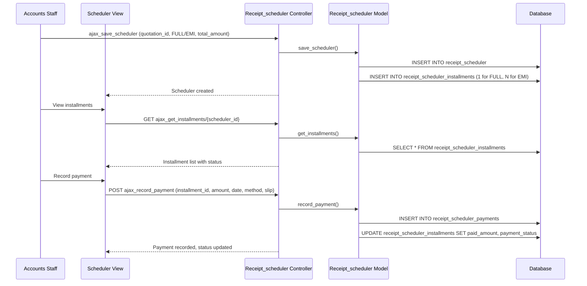

# Workflow: Payment (Receipt Scheduler)

## Purpose

Schedule and track payments received from clients (guests) for their bookings. The receipt scheduler supports both FULL (single payment) and EMI (installment-based) payment plans, with per-installment due dates, payment status tracking, and an append-only payment transaction log.

## Actors

- **Accounts Staff** — Creates payment schedules, records payments, tracks overdue installments
- **Sales Staff** — Views payment status for leads
- **Client** — Makes payments as per schedule

## Database Tables

| Table | Role |
|-------|------|
| `receipt_scheduler` | Payment schedule header (per quotation/lead) |
| `receipt_scheduler_installments` | Installment rows (1 for FULL, N for EMI) |
| `receipt_scheduler_payments` | Append-only payment transactions |
| `quotation` | Parent quotation |
| `leads` | Parent lead |
| `account_details` | Bank account details for payment reference |

## Controllers

- **`Receipt_scheduler.php`** (27 KB) — Main controller
  - `index()` — List view
  - `get()` — DataTables AJAX list
  - `view($id)` — Detail view
  - `ajax_save_scheduler()` — Create/update payment scheduler
  - `ajax_add_installment()` — Add installment
  - `ajax_edit_installment()` — Edit installment
  - `ajax_delete_installment()` — Delete installment
  - `ajax_record_payment()` — Record payment against installment
  - `ajax_get_scheduler()` — Fetch scheduler details
  - `ajax_get_installments()` — Fetch installments for a scheduler
  - `ajax_get_payments()` — Fetch payment history for an installment

## Models

- **`Receipt_scheduler_model.php`** (32 KB) — All payment scheduler DB operations
  - `save_scheduler()`, `add_installment()`, `edit_installment()`, `delete_installment()`
  - `record_payment()`, `get_scheduler()`, `get_installments()`, `get_payments()`
  - `get_financial_posting_defaults()` — Financial summary from quotation

## Views

- `Receipt_scheduler/list.php` — DataTables list
- `Receipt_scheduler/view.php` — Detail with installments and payment history
- `Receipt_scheduler/script.php` — JavaScript
- `Receipt_scheduler/scheduler_modal.php` — Scheduler creation modal
- `Receipt_scheduler/payment_modal.php` — Payment recording modal

## JavaScript / AJAX Endpoints

| Endpoint | Method | Purpose |
|----------|--------|---------|
| `Receipt_scheduler/ajax_save_scheduler` | POST | Create/update scheduler |
| `Receipt_scheduler/ajax_add_installment` | POST | Add installment |
| `Receipt_scheduler/ajax_edit_installment` | POST | Edit installment |
| `Receipt_scheduler/ajax_delete_installment` | POST | Delete installment |
| `Receipt_scheduler/ajax_record_payment` | POST | Record payment (with slip upload) |
| `Receipt_scheduler/ajax_get_scheduler/{id}` | GET | Fetch scheduler |
| `Receipt_scheduler/ajax_get_installments/{id}` | GET | Fetch installments |
| `Receipt_scheduler/ajax_get_payments/{id}` | GET | Fetch payment history |
| `Receipt_scheduler/get` | GET | DataTables server-side list |

## Validation Rules

- **Scheduler**: `quotation_id_fk` required, `payment_type` (FULL/EMI) required, `total_amount` required
- **EMI scheduler**: `max_emi_count` ≥ 2, `split_type` (AMOUNT or PERCENTAGE) required
- **Installment**: `due_date` required; `installment_amount` (AMOUNT split) or `installment_percentage` (PERCENTAGE split) required
- **Payment**: `payment_amount` > 0, `payment_date` required, `payment_method` required

## Business Rules

1. **Payment types**: FULL (single installment) or EMI (multiple installments)
2. **EMI split**: By fixed AMOUNT or by PERCENTAGE of total
3. **Calculated amount**: For PERCENTAGE split, `calculated_amount = total_amount * (percentage / 100)`
4. **Payment status flow**: `PENDING` → `PARTIAL` → `PAID` (or `OVERDUE` if past due_date)
5. **Append-only payments**: Each payment is a new row; no updates or deletes on payment records
6. **Payment slip**: Optional file upload (bank transfer receipt, UPI screenshot, etc.)
7. **Payment methods**: Cash, Card, UPI, Bank Transfer, Cheque
8. **Financial posting defaults**: System can auto-calculate defaults from quotation (confirmed option cost, hotel costs, inclusions, special requirements)
9. **Currency**: Default INR; stored per scheduler
10. **Installment due dates**: Each installment has its own `due_date` for tracking overdue status
11. **Overdue detection**: Installments with `due_date < CURDATE()` and `payment_status != PAID` are marked OVERDUE

## Sequence Diagram



## Data Flow

```
Quotation (confirmed, status=5)
  │
  ▼
Receipt Scheduler created
  ├── payment_type: FULL or EMI
  ├── total_amount
  ├── currency (INR)
  └── Installments
       ├── FULL: 1 installment (100%)
       └── EMI: N installments
            ├── installment_amount (AMOUNT split)
            ├── installment_percentage (PERCENTAGE split)
            ├── calculated_amount
            ├── due_date
            ├── payment_status: PENDING → PARTIAL → PAID / OVERDUE
            ├── paid_amount (cumulative)
            └── Payments (append-only)
                 ├── payment_amount
                 ├── payment_date
                 ├── payment_method (Cash/Card/UPI/Bank/Cheque)
                 └── payment_slip (file path)
```

## Edge Cases

- **Partial payments**: Multiple payments can be recorded against a single installment; status moves PENDING → PARTIAL → PAID
- **Overpayment**: If `paid_amount` exceeds `calculated_amount`, status is PAID (no negative balance tracking)
- **Installment deletion**: Soft-deletes the installment; payments remain for audit
- **Scheduler without quotation**: Technically possible but business process requires a confirmed quotation
- **Financial defaults**: `Quotation_model::get_financial_posting_defaults()` computes expected totals from the confirmed option's hotel costs, inclusions, and special requirements
