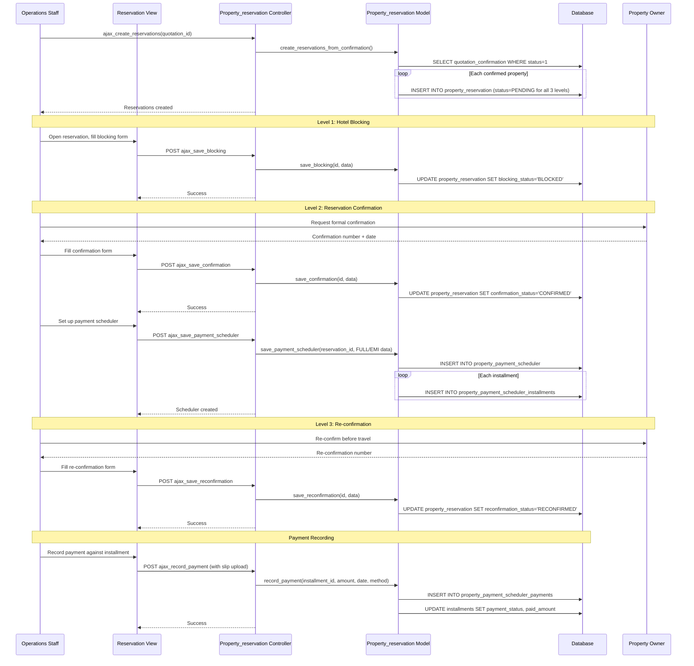

# Workflow: Property Allocation (Reservation)

## Purpose

After a client confirms a quotation, each property (hotel) in the confirmed itinerary must be reserved through a **three-level confirmation process** with the property owner. The company blocks rooms, obtains formal confirmation, and later re-confirms close to the travel date. A payment schedule is created for what the company owes each property owner.

## Actors

- **Operations Staff** — Initiates blocking, records confirmations, manages comments
- **Property Owner/Hotel** — Provides confirmation numbers and cut-off dates
- **Accounts Staff** — Sets up and records property payments
- **Sales Staff** — Views reservation status

## Database Tables

| Table | Role |
|-------|------|
| `property_reservation` | Main reservation record (3-level confirmation fields flattened) |
| `property_payment_scheduler` | Payment header for property owner |
| `property_payment_scheduler_installments` | Installment rows (FULL or EMI) |
| `property_payment_scheduler_payments` | Append-only payment transactions |
| `property_reservation_comments` | 1:N comments per reservation |
| `quotation_confirmation` | Source of confirmed properties/rooms |
| `quotation` | Parent quotation |
| `properties` | Hotel master |

## Controllers

- **`Property_reservation.php`** (29 KB) — Main controller
  - `index()` — List view
  - `get()` — DataTables AJAX list
  - `view($id)` — Detail view with payment scheduler and comments
  - `ajax_create_reservations($quotation_id)` — Auto-create reservations from confirmed quotation
  - `ajax_save_blocking()` — Level 1: Save hotel blocking details
  - `ajax_save_confirmation()` — Level 2: Save reservation confirmation
  - `ajax_save_reconfirmation()` — Level 3: Save re-confirmation
  - `ajax_save_payment_scheduler()` — Create/update property payment schedule
  - `ajax_add_installment()` — Add installment to schedule
  - `ajax_record_payment()` — Record a payment against an installment
  - `ajax_add_comment()` — Add comment to reservation
  - `ajax_get_comments()` — Fetch comments
  - `ajax_get_payment_scheduler()` — Fetch payment scheduler details

## Models

- **`Property_reservation_model.php`** (31 KB) — All reservation DB operations
  - `create_reservations_from_confirmation()` — Auto-create from quotation confirmation
  - `save_blocking()`, `save_confirmation()`, `save_reconfirmation()`
  - `save_payment_scheduler()`, `add_installment()`, `record_payment()`
  - `add_comment()`, `get_comments()`
  - `get_reservation_with_details()`

## Views

- `Property_reservation/list.php` — DataTables list
- `Property_reservation/view.php` — Detail with 3-level confirmation panels, payment scheduler, comments
- `Property_reservation/script.php` — JavaScript for AJAX interactions
- `Property_reservation/payment_scheduler_modal.php` — Payment scheduler modal
- `Property_reservation/comment_section.php` — Comment section partial

## JavaScript / AJAX Endpoints

| Endpoint | Method | Purpose |
|----------|--------|---------|
| `Property_reservation/ajax_create_reservations/{quotation_id}` | POST | Auto-create reservations from confirmed quotation |
| `Property_reservation/ajax_save_blocking` | POST | Save Level 1 (blocking) |
| `Property_reservation/ajax_save_confirmation` | POST | Save Level 2 (confirmation) |
| `Property_reservation/ajax_save_reconfirmation` | POST | Save Level 3 (re-confirmation) |
| `Property_reservation/ajax_save_payment_scheduler` | POST | Create/update payment scheduler |
| `Property_reservation/ajax_add_installment` | POST | Add installment |
| `Property_reservation/ajax_record_payment` | POST | Record payment (with slip upload) |
| `Property_reservation/ajax_add_comment` | POST | Add comment |
| `Property_reservation/ajax_get_comments/{id}` | GET | Fetch comments |
| `Property_reservation/ajax_get_payment_scheduler/{id}` | GET | Fetch payment scheduler |
| `Property_reservation/get` | GET | DataTables server-side list |

## Validation Rules

- **Blocking**: `blocking_cnfm_by` (confirmed by), `blocking_cutoff_date`, `blocking_date` required
- **Confirmation**: `confirmation_cnfm_by`, `confirmation_cnfm_no`, `confirmation_cnfm_date` required
- **Re-confirmation**: `reconfirmation_cnfm_by`, `reconfirmation_cnfm_no`, `reconfirmation_date` required
- **Payment scheduler**: `payment_type` (FULL/EMI), `total_amount` required; EMI requires `max_emi_count` and `split_type`
- **Installment**: `due_date` required; `installment_amount` or `installment_percentage` based on split_type
- **Payment**: `payment_amount`, `payment_date` required; `payment_slip` file upload optional

## Business Rules

1. **Three-level confirmation**: Each reservation progresses through Blocking → Confirmation → Re-confirmation
2. **Level 1 (Blocking)**: Staff requests the hotel to block rooms; records who confirmed, cut-off date, and blocked date
3. **Level 2 (Confirmation)**: Hotel formally confirms the reservation with a confirmation number
4. **Level 3 (Re-confirmation)**: Close to travel date, staff re-confirms with the hotel to ensure rooms are held
5. **Status enums**: Each level has `PENDING` → `BLOCKED`/`CONFIRMED`/`RECONFIRMED`
6. **Payment scheduler mirrors client scheduler**: Same FULL/EMI structure with installments, due dates, payment status
7. **Payment status tracking**: `PENDING` → `PARTIAL` → `PAID` (or `OVERDUE`)
8. **Append-only payments**: Each payment is a new row in `property_payment_scheduler_payments`
9. **Comments**: Staff can add comments at any stage for audit trail
10. **Booking number format**: e.g. `2-26-326` (derived from quotation/option/property IDs)
11. **One reservation per property per quotation**: Unique combination of quotation_id + properties_id
12. **Auto-creation**: Reservations are auto-created from `quotation_confirmation` records when the client confirms

## Sequence Diagram



## Data Flow

```
Quotation Confirmation (client selected properties)
  │
  ▼
Auto-create property_reservation records (one per property)
  │  ├── blocking_status = PENDING
  │  ├── confirmation_status = PENDING
  │  └── reconfirmation_status = PENDING
  │
  ▼
Level 1: Hotel Blocking
  │  ├── blocking_cnfm_by (hotel contact)
  │  ├── blocking_cutoff_date
  │  ├── blocking_date
  │  └── blocking_status → BLOCKED
  │
  ▼
Level 2: Reservation Confirmation
  │  ├── confirmation_cnfm_by
  │  ├── confirmation_cnfm_no (hotel confirmation number)
  │  ├── confirmation_cnfm_date
  │  └── confirmation_status → CONFIRMED
  │       │
  │       └── Payment Scheduler created
  │            ├── property_payment_scheduler (FULL or EMI)
  │            ├── installments (1 for FULL, N for EMI)
  │            └── payments (append-only)
  │
  ▼
Level 3: Re-confirmation
  │  ├── reconfirmation_cnfm_by
  │  ├── reconfirmation_cnfm_no
  │  ├── reconfirmation_date
  │  └── reconfirmation_status → RECONFIRMED
  │
  ▼
Comments (at any stage)
  └── property_reservation_comments (1:N, append-only)
```

## Edge Cases

- **No confirmation exists**: If `quotation_confirmation` has no confirmed properties, no reservations are created
- **Duplicate reservations**: System checks for existing active reservation before creating
- **Partial payments**: Installment `payment_status` moves PENDING → PARTIAL → PAID based on cumulative `paid_amount`
- **Overdue installments**: Installments past `due_date` with unpaid balance are marked OVERDUE
- **Payment slip upload**: File is uploaded to `uploads/` directory; path stored in payment record
- **Re-confirmation without prior levels**: Technically possible in the UI but business process requires sequential completion
- **Cancellation interaction**: If a booking is cancelled, `booking_cancellation_property` references the reservation (FK RESTRICT prevents deletion)
