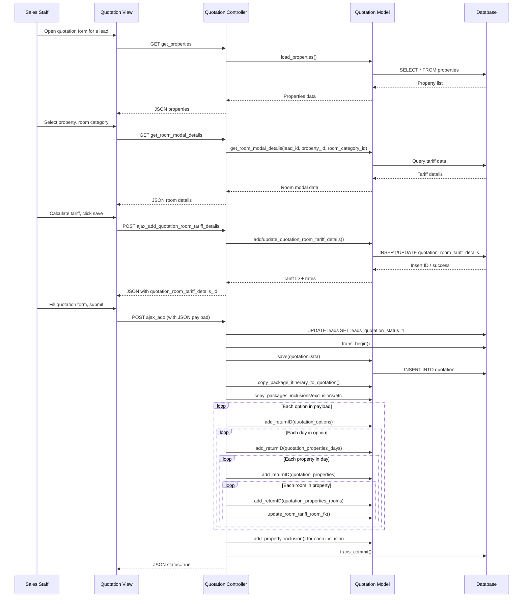

# Workflow: Quotation Management

## Purpose

Generate customized travel quotations from pre-built packages for specific leads. A quotation can contain multiple options (variants with different hotels, room categories, vehicles, meal plans), each with day-by-day property breakdowns, room tariff calculations, inclusions, exclusions, payment policies, terms, cancellation policies, and notes.

## Actors

- **Sales Staff** — Creates and edits quotations
- **Sales Manager** — Reviews quotations (via quotation review system)
- **Client** — Views quotation preview and confirms via client confirmation link

## Database Tables

| Table | Role |
|-------|------|
| `quotation` | Quotation header |
| `quotation_options` | Option variants within a quotation |
| `quotation_properties_days` | Day-by-day structure per option |
| `quotation_properties` | Properties (hotels) per day |
| `quotation_properties_rooms` | Room categories per property |
| `quotation_room_tariff_details` | Detailed tariff per room (pax, beds, supplements) |
| `quotation_itinerary` | Itinerary header |
| `quotation_itinerary_days` | Day-by-day itinerary |
| `quotation_inclusions` | Inclusions |
| `quotation_exclusion` | Exclusions |
| `quotation_optional_add_on` | Optional add-ons |
| `quotation_payment_policies` | Payment policies |
| `quotation_terms_condition` | Terms & conditions |
| `quotation_cancellation_policies` | Cancellation policies |
| `quotation_notes` | Notes |
| `quotation_special_requirements` | Special requirements per day |
| `quotation_property_inclusions` | Property-specific inclusions |
| `quotation_review` | Review ratings and comments |
| `leads` | Lead master (updated `leads_quotation_status`) |
| `packages` (and child tables) | Source package data copied into quotation |

## Controllers

- **`Quotation.php`** (189 KB, 8545 lines) — Main controller
  - `index()` — List view with staff, users, inclusions, policies
  - `preview_quotation($quotation_id)` — Read-only preview
  - `ajax_add()` — Create quotation with full transaction
  - `ajax_itinerary_update()` — Update itinerary and child tables
  - `ajax_delete()` — Soft-delete quotation and all children
  - `ajax_edit_delete($id)` — Get quotation for editing
  - `get_properties()` — AJAX: list all properties
  - `get_rooms()` — AJAX: rooms for a property
  - `get_room_modal_details()` — AJAX: room tariff modal data
  - `ajax_get_tariff_by_context()` — AJAX: tariff by lead/day/property/room
  - `ajax_add_quotation_room_tariff_details()` — AJAX: save room tariff calculation
  - `ajax_get_quotation_room_tariff_details()` — AJAX: get saved tariff
  - `ajax_get_saved_quotation_room_tariff_details_by_id()` — AJAX: get tariff by ID
  - `ajax_get_vehicle_list()` — AJAX: active vehicles

## Models

- **`Quotation_model.php`** (185 KB) — All quotation DB operations
  - `save()`, `get_by_id()`, `update()`, `last_id_quotation()`
  - `copy_package_itinerary_to_quotation()`, `copy_package_itinerary_days_to_quotation()`
  - `copy_packages_inclusions()`, `copy_packages_exclusions()`, etc.
  - `get_quotation_options_full()` — Full option/day/property/room tree
  - `get_tariff_by_context()` — Tariff lookup
  - `add_quotation_room_tariff_details()`, `update_quotation_room_tariff_details()`
  - `get_financial_posting_defaults()` — Financial summary for confirmed option
  - `get_quotation_options_for_confirmation()` — Options for client confirmation
  - `get_confirmation_option_details()` — Day/property/room tree for confirmation

## Views

- `Quotation/list.php` — DataTables list of quotations
- `Quotation/script.php` — JavaScript for list page
- `Quotation/preview.php` — Read-only quotation preview
- `Quotation/quotation_modal_script.php` — Modal scripts for tariff calculation

## JavaScript / AJAX Endpoints

| Endpoint | Method | Purpose |
|----------|--------|---------|
| `Quotation/ajax_add` | POST | Create quotation (JSON payload with options, days, properties, rooms, inclusions, special requirements) |
| `Quotation/ajax_itinerary_update` | POST | Update quotation itinerary and child tables |
| `Quotation/ajax_delete` | POST | Soft-delete quotation |
| `Quotation/ajax_edit_delete/{id}` | GET | Get quotation data for editing |
| `Quotation/get_properties` | GET | List all properties |
| `Quotation/get_rooms?properties_id=X` | GET | Rooms for a property |
| `Quotation/get_room_modal_details` | GET | Room tariff modal data (lead_id, property_id, room_category_id) |
| `Quotation/ajax_get_tariff_by_context` | GET | Get tariff by lead/day/destination/property/room |
| `Quotation/ajax_add_quotation_room_tariff_details` | POST | Save/update room tariff calculation |
| `Quotation/ajax_get_quotation_room_tariff_details` | GET | Get saved tariff by day+room |
| `Quotation/ajax_get_saved_quotation_room_tariff_details_by_id` | GET | Get tariff by ID |
| `Quotation/ajax_get_vehicle_list` | GET | List active vehicles |
| `Quotation/preview_quotation/{id}` | GET | Preview quotation |

## Validation Rules

- **Quotation date**: Required, parsed via `str_replace` and `strtotime`
- **Leads ID**: Required (integer)
- **Package ID**: Required (integer)
- **Options payload**: JSON-decoded; each option must have title, cab_amount, total_cost, total_quote_rate
- **Room tariff**: All numeric fields cast to `(int)` or `(float)`; auto and manual rates tracked separately
- **Cover pages**: Image upload with fallback to existing path

## Business Rules

1. **Quotation number** is auto-generated as `Quot-{last_id + 1}`
2. **Package data is copied** into quotation tables (itinerary, inclusions, exclusions, optional add-ons, payment policies, terms, cancellation policies, notes) — quotation is independent of package after creation
3. **Cover page images** are copied from package to quotation uploads directory
4. **`quotation_current_status` = 2** on creation (draft/created)
5. **`leads_quotation_status`** is set to 1 on the lead when a quotation is created
6. **Room tariff details** are saved independently via AJAX before quotation save, then linked via `quotation_room_tariff_details_id` during `ajax_add`
7. **Transaction safety**: `ajax_add` uses `$this->db->trans_begin()` with try/catch; any insert failure rolls back
8. **Option-to-day-to-property-to-room hierarchy**: Options → Days → Properties → Rooms, each inserted sequentially with FK references
9. **Property inclusions** are mapped from package option IDs to quotation option IDs via `$optionMap`
10. **Soft delete**: `ajax_delete` sets status=0 on quotation and ALL child tables recursively (options → days → properties → rooms), and resets `leads_quotation_status` to 0
11. **Update strategy**: `ajax_itinerary_update` updates only itinerary day descriptions + images, then deletes and reinserts all other child tables (non-itinerary)
12. **Margin**: Each option has `quotation_options_margin_type` (FIXED or PERCENTAGE) and `quotation_options_margin_value`
13. **Amount type**: Options can be `net` or `gross` (`quotation_options_amount_type`)
14. **Per-person amount**: `quotation_options_per_amount` for per-person pricing

## Sequence Diagram



## Data Flow

```
Package (template)
  ├── Itinerary + Days
  ├── Inclusions / Exclusions / Add-ons
  ├── Payment Policies / Terms / Cancellation Policies / Notes
  └── Properties + Days + Rooms
        │
        ▼ (copy on quotation create)
Quotation
  ├── Quotation Options (1:N)
  │     ├── Days (1:N)
  │     │     ├── Properties (1:N)
  │     │     │     ├── Rooms (1:N)
  │     │     │     │     └── Room Tariff Details (1:1, saved via AJAX)
  │     │     │     └── Property Inclusions
  │     │     └── Special Requirements
  │     └── Vehicle, Cab Amount, Margin, Total Cost, Quote Rate
  ├── Itinerary + Days (copied, editable)
  ├── Inclusions / Exclusions / Add-ons (copied, editable)
  ├── Payment Policies / Terms / Cancellation Policies / Notes (copied, editable)
  └── Cover Pages (copied from package)
```

## Edge Cases

- **Empty quotation table**: If no quotations exist, `quotation_number` starts at `Quot-1`
- **Room tariff saved before quotation**: Tariff records are created with `quotation_properties_rooms_id_fk = 0`, then updated with the real FK after room insert
- **Package cover pages**: Copied to quotation-specific upload directory via `copy_file_to_quotation_cover()`
- **Transaction failure**: Any insert failure in the nested loop throws an exception, triggering `trans_rollback()`
- **Delete cascading**: Soft-deleting a quotation recursively sets status=0 on all 12+ child tables and resets lead quotation status
- **Update vs reinsert**: Itinerary days are updated in-place; all other child tables are deleted and reinserted
